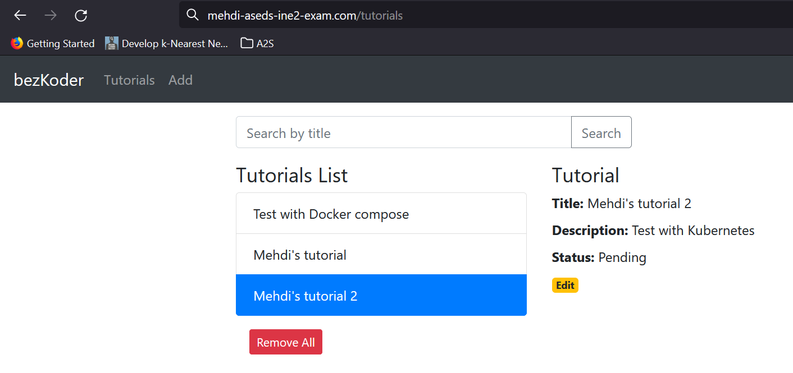

# Tutorials App with Docker and Kubernetes

This repository contains the source code and configuration files for containerizing a Tutorials App, an application built with Angular, Spring, and MySQL. It utilizes Docker for containerization and Kubernetes for orchestration.

## Project Structure

The project is structured as follows:

- **frontend:** Contains the Angular frontend code.
- **backend:** Contains the Spring backend code.
- **k8s:** Contains yaml files for k8s.
- **tutorials-app-chart:** Contains a helm chart of the app .

## Prerequisites

Before you begin, ensure you have the following installed:

- Docker: [https://docs.docker.com/get-docker/](https://docs.docker.com/get-docker/)
- Kubernetes: [https://kubernetes.io/docs/setup/](https://kubernetes.io/docs/setup/)
- kubectl: [https://kubernetes.io/docs/tasks/tools/install-kubectl/](https://kubernetes.io/docs/tasks/tools/install-kubectl/)

## Getting Started

1. Clone this repository:

    ```bash
    git clone https://github.com/your-username/tutorials-app.git
    cd tutorials-app
    ```

2. Build and run the Docker containers:

    ```bash
    docker-compose up -d
    ```

3. Apply Kubernetes configurations:

    ```bash
    kubectl apply -f k8s/
    ```

4. Access the application:

    Open your browser and go to [http://mehdi-aseds-ine2-exam.com/](http://mehdi-aseds-ine2-exam.com/)

## Screenshots



<!-- Add more screenshots or visuals as needed -->

## Contributing

Feel free to contribute to the project. You can raise issues or submit pull requests.


